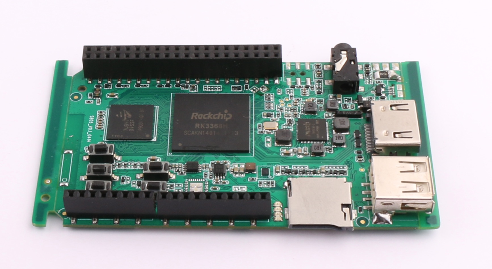
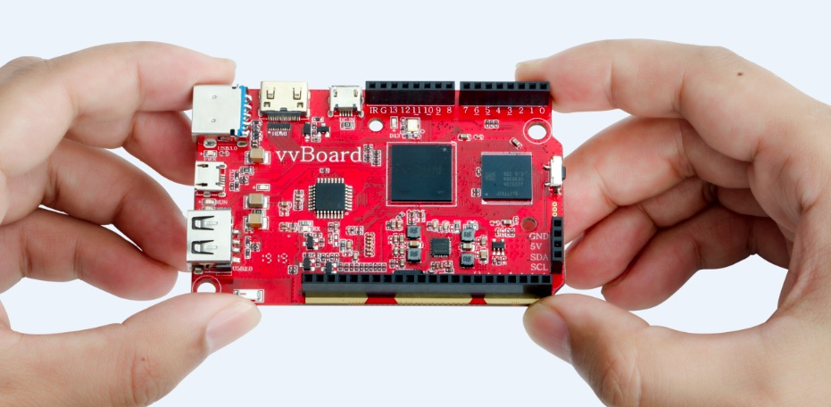

## 虚谷号的故事

自从“虚谷号”的消息发布以来，常常有熟悉的创客老师问有关“虚谷号”的细节。他们很好奇，我们为什么会设计一款新的开源硬件。是受到“中兴事件”的刺激而想要有一款中国芯的开源硬件，还是在各种融资的好消息刺激下，也要做款产品赚点钱？当然，他们更多是关心这一开源硬件具有怎样的特点，是否更加适用于中小学，帮助他们能够更好地开展创客教育。

如果认真追溯下去，设计虚谷号的理由也许很复杂，也许真的关乎爱国，关乎情怀。参与“虚谷计划”的每一个成员，背后都有一个关乎教育关乎技术教育的故事。但要归纳一个最核心的理由却是简简单单的一句话：

我们找不到想要的开源硬件。

### 我们的思考

 
2016年，普通高中信息技术教材开始编写。新教材的必修模块和选择性必修模块都有开源硬件方面的内容。因为新教材的编程语言选择了Python。在这种背景下，应该选择哪些开源硬件进入教材成为一道难题。

如果选择Arduino？Arduino的编程语言是C/C++，没有基于Python的IDE。鉴于高中生的学习能力，又不能使用Mixly或者ArduBlock之类的图形化编程环境。

如果选择树莓派？先不说树莓派算不算一款开源硬件，最重要的是用树莓派没法上课！如果用树莓派来上课，机房里要准备几个屏幕？几套键盘？无论是国内还是国外，在大班教学中用树莓派几乎不可见。而高中的信息技术教学是大班上课的。

那能不能选择micro:bit？不，micro:bit的性能实在太弱了。说是支持MicroPython，其实是阉割的MicroPython。只要写几句和字符处理相关的功能，板子就会死机。还不支持无线网络（Wi-Fi），扩展功能极其有限，非常鸡肋。小学生用了入门挺好，高中实在不能使用。

### 我们的需求
 
我们想要怎样的开源硬件？那就是入门要简单，扩展要方便，就如Python语言一样，适合非专业的人使用，也能写出非常复杂的如机器学习方面的代码。Arduino再好，它毕竟不是为教育而设计。micro:bit再好，只能在入门时玩玩。树莓派再好，也只能适合那些玩Linux的高手。

盘点当前的开源硬件，micro:bit、Arduino和树莓派三者之间无法形成一个循序渐进的学习体系。micro:bit和Arduino，几乎是完全不同的体系，Arduino和树莓派，也不是一个知识体系。当你试图考虑中小学的开源硬件学习路径的时候，现有的产品就存在很大的问题。

决心重新自己设计一块教学用开源硬件想法，则是在2017年11月的台北makerFaire上的两岸教育创客之间的一番讨论。中国拥有全球最好的电子加工产业，在开源硬件方面已经有很多年的积累。DFRobot和Seeed Studio在开源硬件销售方面全球排名前五，他们生产的开源硬件和周边模块销往世界各地。厚积薄发，是时候开始设计中国的开源硬件了。

### 我们的行动
 
创意当实现！

一开始，我们给这一块开源硬件板子取名为“虚谷”，其寓意是：虚怀若谷，兼容并蓄，继往开来。“虚谷”要继承Arduino、树莓派、micro:bit等开源硬件的优点，而不是另起炉灶重新造一个“轮子”，用一句话去描述开发目标：

技术门槛如micro:bit一样低，支持Python和网络，支持虚拟磁盘烧录，性能和成本优于树莓派，能够兼容大部分Arduino项目。

一个月后，在北京一个以“人工智能教育”为主题的研讨会上，“虚谷”引起了深圳希科普公司CEO刘军的关注。2018年初，他组了一个团队开始研发。随后，来自全国各地的教育创客先后加入，需求越来越清晰。这块板子的最终名称确定为“虚谷号”，英文名为vvBoard。

2018年5月4日——第一块虚谷号（测试版）正式亮相！

2019年6月，虚谷号开始量产，并通过猫友汇邀请全国的信息技术教师、教育创客共同测试，获得好评。

